# Real-Estate-Trend-Analysis-Tableau

# 🏠 A Decade of Property Sales: Real Estate Trend Analysis (2011–2021)

### What Is This Project About?
Imagine a city planner trying to decide where to build new schools, how to set property taxes, or where to invest in roads — without knowing what the property market has actually been doing for the past decade.

This project analyses **526,276 property sale transactions** across **50 towns** over **11 years (2011–2021)**. The goal is simple: turn a massive pile of raw data into a clear, interactive dashboard that helps planners and investors make smarter decisions.

The entire dashboard was built in **Tableau** and is fully interactive — you can filter by town, year, property type, and switch between different financial views.

🔗 **[Click here to explore the live interactive dashboard](https://public.tableau.com/app/profile/gopal.sarkar/viz/Real_Estate_Insights_Dashboard/Dashboard1)**

---

## Tools Used
- **Tableau** — for building all charts, maps, and the interactive dashboard
- **Excel** — raw data source containing 526,276 rows of property transactions
- **Calculated Fields in Tableau** — to create sale categories (High / Medium / Low) and yearly comparisons
- **Parameters** — to let users switch between Sale Amount and Assessed Value views
- **Dashboard Actions** — clicking one chart automatically filters all other charts on the dashboard

---

## About the Data

| Column | What It Means |
| :--- | :--- |
| List Year | The year the property was listed for sale |
| Town | Which of the 50 towns the property is in |
| Sale Amount | The final price the property sold for |
| Assessed Value | The government's official estimated value of the property |
| Sales Ratio | How close the assessed value is to the actual sale price |
| Property Type | Whether it is a Single Family home, Condo, Commercial building, etc. |

**Total records: 526,276 sales across 50 towns from 2011 to 2021**

---

## Key Numbers

| What We Found | Number |
|---|---|
| Total property sales analysed | 526,276 |
| Years covered | 2011 to 2021 (11 years) |
| Number of towns | 50 |
| Biggest sales year | **2020 — $40.29 Billion** |
| Smallest sales year | 2011 — $12.17 Billion |
| How much the market grew | **+231% from 2011 to 2020** |
| Most common property type | Single Family homes — 57% of all sales |
| Best month for sales | March — highest month-on-month growth at +30% |

---

## Dashboard Preview

### Full Dashboard
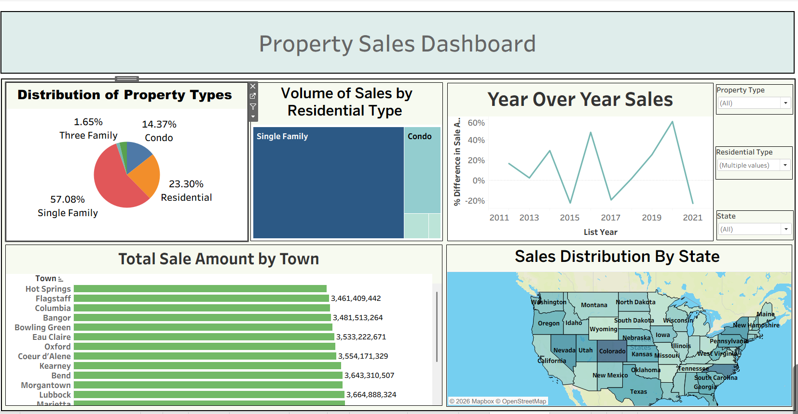

### Year Over Year Sales — The 2020 Surge
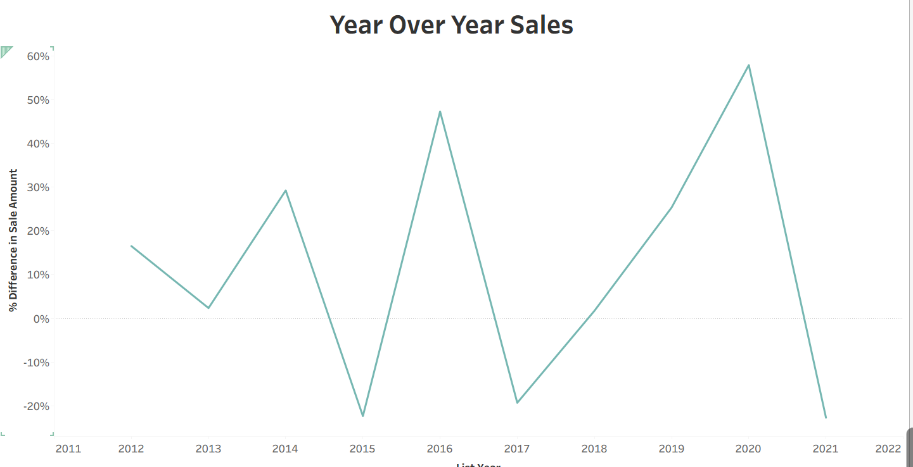

### Which Type of Property Sells the Most?
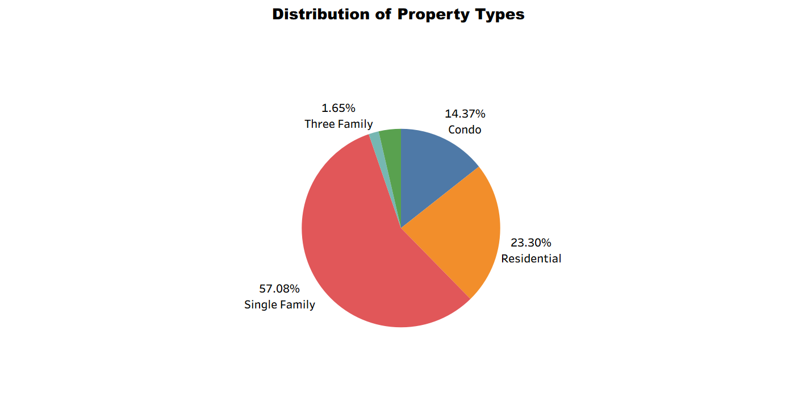

### Which Towns Have the Highest Total Sales?
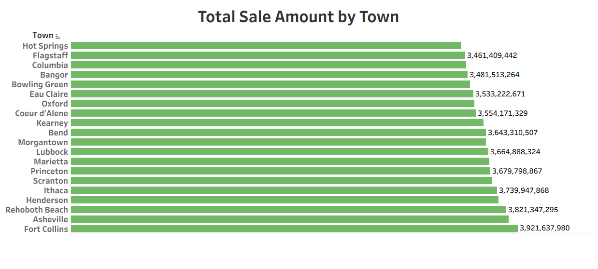

### How Sales Are Categorised — High, Medium, Low
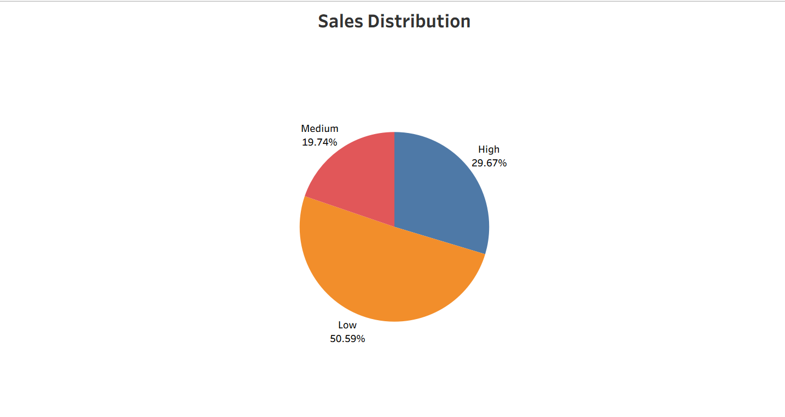

### Month by Month Sales Pattern
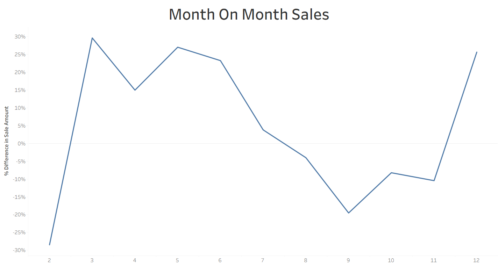

### How Much Each Residential Type Contributes
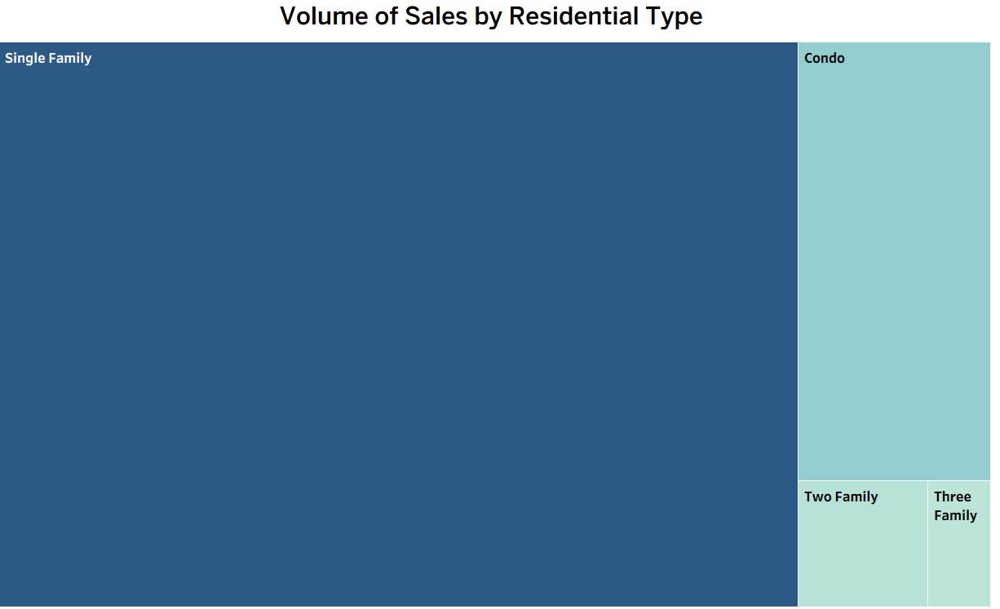

### Sales Spread Across the United States
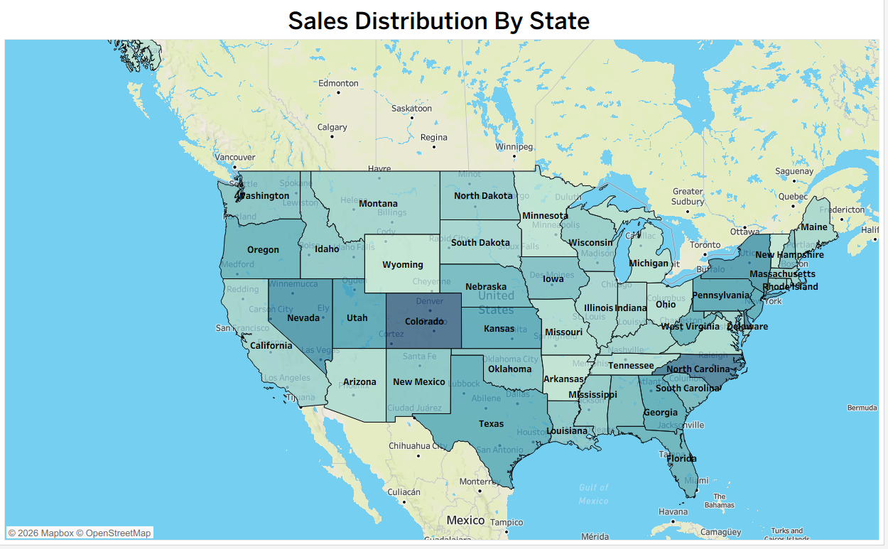

### Exact Revenue by Year
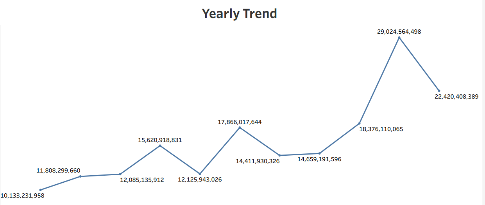

### Monthly Revenue Totals
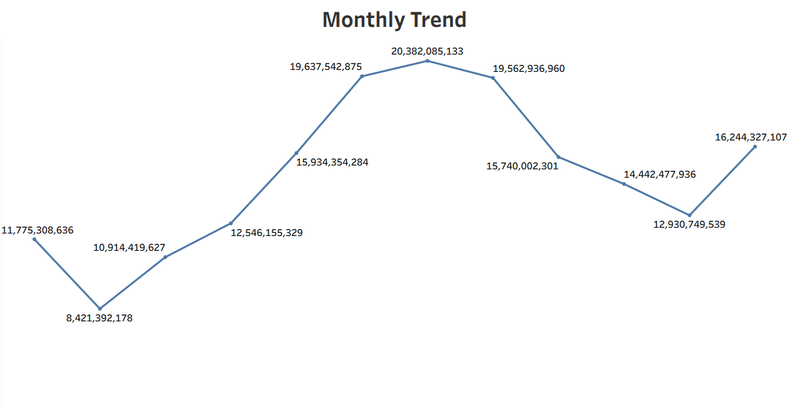

### Sales Ratio Compared Across Every Town
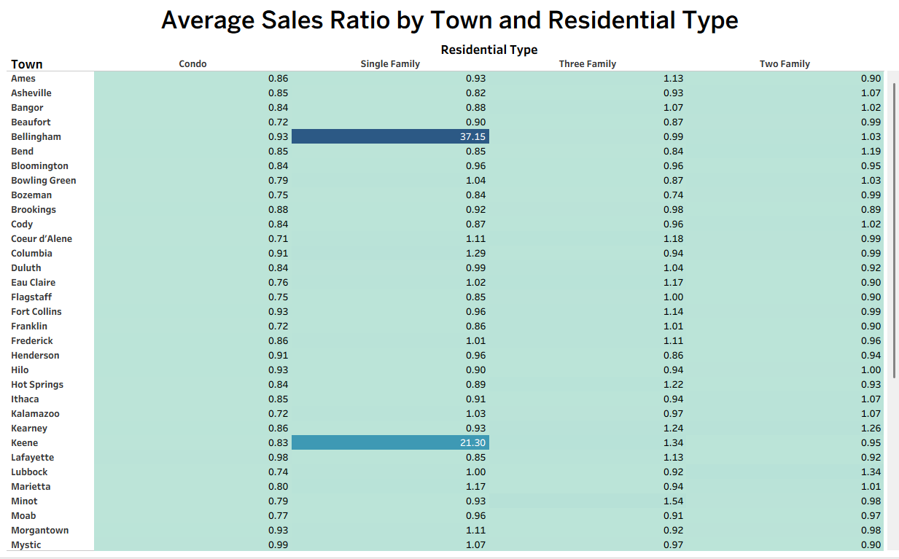

### Story Slide — Year Over Year Narrative
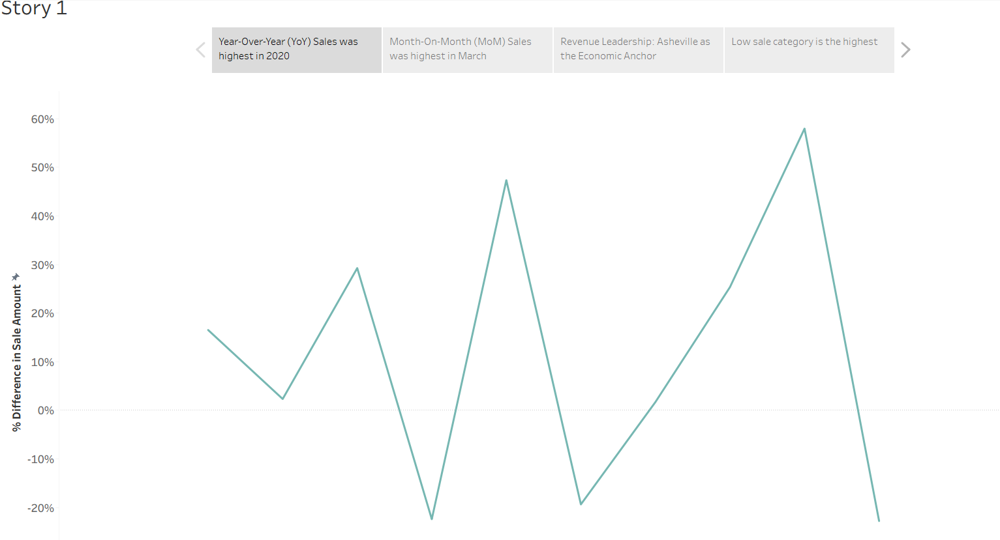

---

## What Does the Data Tell Us?

**1. Something unusual happened in 2020.**
Property sales jumped from $22.1 Billion in 2019 to $40.3 Billion in 2020 — an 82% increase in just one year. This was likely driven by people moving out of cities during the pandemic and low interest rates making it cheaper to buy homes. Any decision based on pre-2020 data is now outdated.

**2. Most people are buying Single Family homes.**
57% of all 526,276 transactions are Single Family properties. This tells planners that people want houses with their own space — not apartments. Infrastructure like roads, schools, and utilities should be built to match this demand.

**3. The market has not gone back to where it was before 2020.**
Even after the surge, 2021 sales were still $30.58 Billion — which is 38% higher than 2019. The market has permanently moved to a higher level. This is important for tax assessments and investment planning.

**4. March is the best month for property sales.**
Month-on-month data shows March has the highest sales growth at +30%. This tells real estate agents and investors the best time of year to list properties.

---

## Recommendations

1. **Update property tax assessments** — Government assessments based on pre-2020 values are likely too low. Properties are now worth significantly more.
2. **Focus new development on Single Family housing** — With 57% of transactions being Single Family homes, this is clearly what buyers want most.
3. **Plan for the new baseline** — The $30B+ sales level is now normal. Budget planning, zoning, and infrastructure investment should use this as the starting point, not pre-2020 figures.
4. **Time listings and campaigns for March** — Sales activity peaks in March every year. Marketing and launches should be planned around this window.

---

## Project Structure

```
📁 Real-Estate-Trend-Analysis-Tableau/
│
├── 📁 Dataset/
│   └── README.md (contains dataset download link)
│
├── 📁 Dashboards/
│   └── Real_Estate_Insights_Dashboard_view.twbx
│
├── 📁 Images/
│   ├── Main_Dashboard_View.png
│   ├── Year_Over_Year_Sales_Trend.png
│   ├── Property_Type_Breakdown.png
│   ├── Top_Towns_Bar_Chart.png
│   ├── Sales_Distribution_Category.png
│   ├── Month_On_Month_Sales.png
│   ├── Residential_Type_Treemap.png
│   ├── Sales_Distribution_Map.png
│   ├── Yearly_Trend.png
│   ├── Monthly_Trend.png
│   ├── Sales_Ratio_Highlight_Table.png
│   └── Story_Slide_YoY_Sales.png
│
└── README.md
```
